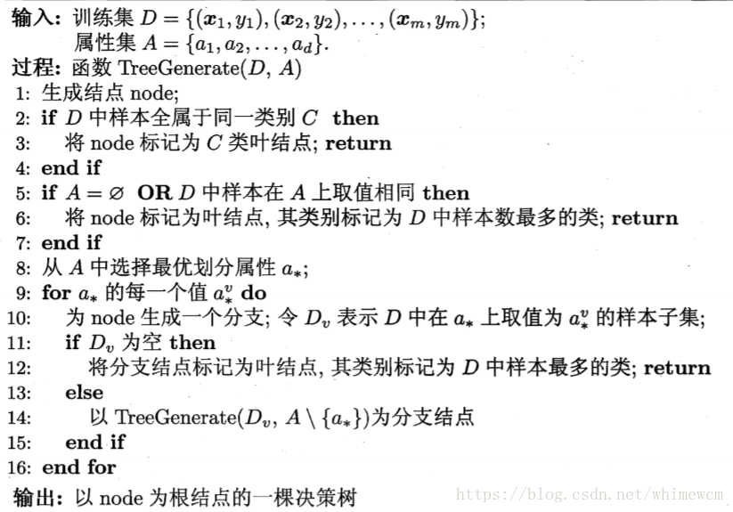

# Java 数值分析基本工具类

## v 0.0 参考网上规范

```  
    首先说明一下，这个工具类的规范不是我定义的，而是参考众多知名开源框架发现的。
    
    先说第一种情况，如果工具类中的方法全部时静态方法，那么可以将工具类作为一个 abstract 抽象类。Spring 框架中存在大量的这样的使用。
    
    然后，如果工具类中有异常，请抛出，不要自己去 try-catch。更不要 try 了之后 e.printStackTrace() 。
    
    还有就是工具类中要不要打印日志问题，尽量不要打印，像 log4j 这样的一些第三方日志框架也不要用。降低于第三方类库的依赖。
    
    还有一情况是，工具类中的方法非 static 的。那你可以将工具类定义为 final class，考虑到工具类应该不能被继承。在私有化它的构造函数，提供一个单例。
    
    工具类的命名应该用 Util 结尾，例如 LogUtil。
    
    至于工具类中的方法应该设计为静态的还是非静态的，这个没有统一的标准。各有各的好，参加大多数开源框架，static 的多一些。
    
    像大名鼎鼎的 Hutool，它提到了工具类的 6 大设计思想。方法优先于对象、自动识别优于用户定义、便捷性与灵活性并存、适配与兼容、可选依赖原则、无侵入原则。
```

* v 0.1 基本结构

> 代码规范尽可能参考Hutool，尽可能减少对外部库的依赖。

## v 0.7 完成一些基本的数值分析方法

```java
    // 复合梯形积分测试
    // 辛普森积分测试
    // 龙格-库塔常微分测试
    // 二分法解方程测试
    // 连续求导测试
    // 牛顿法迭代求方程测试
    // ...
```

## v 1.0 数值分析 -- 线性代数

> 代码参考colt

* v 2.0 添加测试代码

## v 2.1 - v 2.3 参考sklearn的使用及部分源码编写机器学习算法，k邻近算法

参考博客： `https://blog.csdn.net/linxid/article/details/79271847`

步骤参考：

    1>分别计算改点与已经类型数据集中的每个点之间的距离；
    2>按距离递增排序；
    3>选取距离最小的前k个点；
    4>统计这k个点，对应类别，每个类别出现的频率；
    5>这k个点，对应类别，出现频率最高的作为当前点的预测分类；
    
参数参考：

* n_neighbors：默认为5，就是k-NN的k的值，选取最近的k个点。

* weights：默认是uniform，参数可以是uniform、distance，也可以是用户自己定义的函数。uniform是均等的权重，就说所有的邻近点的权重都是相等的。distance是不均等的权重，距离近的点比距离远的点的影响大。用户自定义的函数，接收距离的数组，返回一组维数相同的权重。

* algorithm：快速k近邻搜索算法，默认参数为auto，可以理解为算法自己决定合适的搜索算法。除此之外，用户也可以自己指定搜索算法ball_tree、kd_tree、brute方法进行搜索，brute是蛮力搜索，也就是线性扫描，当训练集很大时，计算非常耗时。kd_tree，构造kd树存储数据以便对其进行快速检索的树形数据结构，kd树也就是数据结构中的二叉树。以中值切分构造的树，每个结点是一个超矩形，在维数小于20时效率高。ball tree是为了克服kd树高纬失效而发明的，其构造过程是以质心C和半径r分割样本空间，每个节点是一个超球体。

* leaf_size：默认是30，这个是构造的kd树和ball树的大小。这个值的设置会影响树构建的速度和搜索速度，同样也影响着存储树所需的内存大小。需要根据问题的性质选择最优的大小。

* metric：用于距离度量，默认度量是minkowski，也就是p=2的欧氏距离(欧几里德度量)。

* p：距离度量公式。在上小结，我们使用欧氏距离公式进行距离度量。除此之外，还有其他的度量方法，例如曼哈顿距离。这个参数默认为2，也就是默认使用欧式距离公式进行距离度量。也可以设置为1，使用曼哈顿距离公式进行距离度量。

* metric_params：距离公式的其他关键参数，这个可以不管，使用默认的None即可。

* n_jobs：并行处理设置。默认为1，临近点搜索并行工作数。如果为-1，那么CPU的所有cores都用于并行工作。

方法参考

* fit(X, y)：使用X作为训练数据，y作为训练标签（目标值）来拟合模型（分类器）

* get_params([deep])：得到分类器的参数

* kneighbors([X, n_neighbors, return_distanced])：返回一个点的k近邻

* kneighbors_graph([X, neighbors, mode])：

* predict(X)：预测类别未知数据X的类别

* predict_proba(X)：返回数据X预测的各类别的概率

* score(X,y[,sample_weight])：对于测试数据，返回预测的得分结果

* set_params( **params):设置分类器的参数 
用到最多的便是，fit、predict、score

## v 2.4 - v 3.0 编写机器学习算法，朴素贝叶斯算法

参考博客： `https://blog.csdn.net/v_victor/article/details/51319873`

参考视频： `https://www.bilibili.com/video/av36338359?from=search&seid=10770883594736204654`

步骤参考：
    
    >1. 计算先验概率 P(A) 如：P(Iris的类别1)、P(是Iris的类别2)
    >2. 计算 P(B|A) 如：P(Iris特征1| Iris的类别1) * P(Iris特征2| Iris的类别1) 、P(Iris特征1| Iris的类别2) * P(Iris特征2| Iris的类别2)
    >3. 对于类别1 的贝叶斯分子为： P(Iris的类别1) * P(Iris特征1| Iris的类别1) * P(Iris特征2| Iris的类别1) 全部取log
    >4. 最终结果为： 谁的贝叶斯分子大，就是那个类别

注意事项：
    
    1. 我采用的方法好像是针对离散的特征数据，然而我的测试数据是Iris（sklearn自带的测试数据），因此在判断特征时，使用了传入的误差数据进行判断
    2. 如果在计算条件概率时，一个概率值为0，那么最后的乘积也是0。这会影响后验概率的计算结果，使分类产生偏差。为了降低这种影响，可以采用贝叶斯估计。 拉普拉斯平滑
    3. 另外遇到一个问题就是下溢出，这是由于太多很小的数相乘造成的。这种解决方法是对乘机取自然对数。在代数中，ln(a*b*c)=ln(a)+ln(b)+ln(c)。代码里面整体取对数相加。
    
测试结果：
    
    e（判断相等误差）设置为0.5时测试集全部通过 /W\

## v 3.3 - v 4.7 决策树实现(ID3版本，还有部分未知bug！！)

参考博客：  `https://blog.csdn.net/it_beecoder/article/details/79554388`
            `https://blog.csdn.net/u012328159/article/details/79396893`
            `https://blog.csdn.net/ichuzhen/article/details/53981715`

参考视频：  `https://www.bilibili.com/video/av35848965?t=115`

步骤参考：
    
    >1. 对数据离散化
    >2. 如下图建多叉树（实际建树过程在终止条件上有差异）

    >3. 保存建的多叉树，等待对传入测试数据的测试

TODO 决策树实现有问题，先学习SVM吧, 发现SVM比决策树还复杂，/W\

## v 5.0 准备，支持向量机 SVM实现

